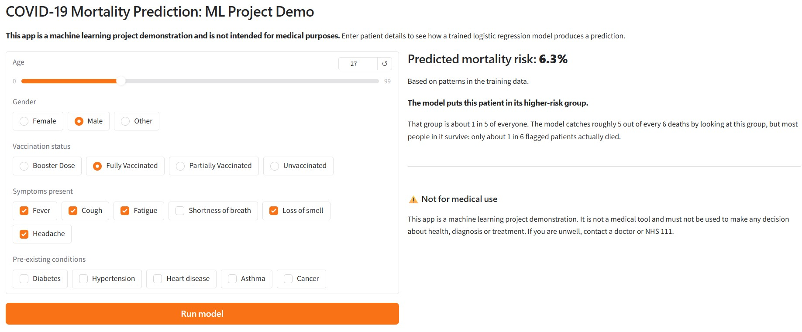

# COVID-19 Mortality Prediction with Machine Learning

A machine learning project that predicts COVID-19 mortality from patient age, gender, vaccination status, symptoms and pre-existing conditions. It covers the full workflow: data auditing, leakage detection, feature engineering, model comparison, calibration, threshold selection and deployment as an interactive Gradio app.

> **This project is a machine learning demonstration and is not intended for medical purposes.**



Built with pandas, NumPy, Matplotlib and scikit-learn.

## Dataset

[COVID-19 Symptoms and Severity Prediction Dataset](https://www.kaggle.com/datasets/khushikyad001/covid-19-symptoms-and-severity-prediction-dataset) (Kaggle)

3,000 patients, 17 columns: age, gender, vaccination status, six symptoms (fever, cough, fatigue, shortness of breath, loss of smell, headache), five conditions (diabetes, hypertension, heart disease, asthma, cancer), and three outcomes (hospitalized, ICU admission, mortality).

The target is `mortality`: 131 deaths (4.37%), an imbalance of about 22 survivors per death.

The dataset is not included in this repo. Download it from Kaggle and update the path in the first notebook cell.

## Approach

**1. Data audit.** No missing values, no invalid codes, all binary columns valid. 49 duplicate rows were investigated rather than dropped by default: duplicated rows averaged 1.02 symptom and condition flags versus 2.54 across all patients, and the all-zero profile made up 37.5% of duplicates but only 6.1% of patients. That concentration in sparse profiles points to chance collisions rather than repeated records, so they were kept. A sensitivity check confirmed removing them does not change the results.

**2. Leakage removal.** Two columns were dropped:

- `hospitalized`: the death rate among non-hospitalised patients was exactly 0%, so it perfectly separated the target.
- `icu_admission`: ICU patients died at 13.6% versus 15.6% for hospitalised non-ICU patients, which is clinically implausible and adds no valid signal.

**3. Feature engineering and collinearity.** Symptom count and comorbidity count were created. Keeping both the counts and their component columns causes perfect multicollinearity, so two feature sets were compared:

- Set A: individual indicators, 17 features, 5.8 events per variable
- Set B: counts only, 8 features, 12.3 events per variable

Set B performed better (test ROC-AUC 0.866 vs 0.842) with half the features.

**4. Model comparison (Set B).**

| Model               | CV ROC-AUC | CV PR-AUC | Test ROC-AUC | Test PR-AUC |
| ------------------- | ---------- | --------- | ------------ | ----------- |
| Logistic Regression | 0.868      | 0.154     | 0.866        | 0.162       |
| Random Forest       | 0.848      | 0.138     | 0.828        | 0.160       |
| Gradient Boosting   | 0.834      | 0.129     | 0.801        | 0.137       |

Logistic regression won on every metric, suggesting the relationships in the data are close to linear and additive.

**5. Calibration.** Using `class_weight='balanced'` inflated predicted risk sevenfold (mean prediction 0.306 against an actual rate of 0.044) without improving discrimination:

| Variant             | ROC-AUC | Brier  | Mean prediction |
| ------------------- | ------- | ------ | --------------- |
| Balanced            | 0.866   | 0.1703 | 0.306           |
| Unweighted          | 0.864   | 0.0403 | 0.047           |
| Balanced + isotonic | 0.867   | 0.0387 | 0.049           |

Predicting the base rate for everyone gives a Brier score of 0.0421, so the balanced model was worse than that baseline. The unweighted model was chosen: it is well calibrated and simpler, and recall is controlled through the decision threshold instead.

**6. Threshold selection.** Rather than defaulting to 0.5, the threshold was chosen to give the best specificity while keeping sensitivity at 80% or above. This gave a threshold of 0.06.

## Results

Final model: unweighted logistic regression on Set B.

| Metric                        | Value                          |
| ----------------------------- | ------------------------------ |
| ROC-AUC (30 random splits)    | 0.866 (SD 0.015)               |
| PR-AUC (30 random splits)     | 0.167 (SD 0.021)               |
| PR-AUC no-skill baseline      | 0.044                          |
| Brier score                   | 0.0403                         |
| Sensitivity at threshold 0.06 | 0.848 (28 of 33 deaths caught) |
| Specificity                   | 0.801                          |
| Precision                     | 0.164                          |
| Patients flagged              | 171 of 750 (22.8%)             |

The gap between ROC-AUC (0.866) and PR-AUC (0.167) is the main lesson here. On imbalanced data, ROC-AUC can look strong while precision stays low: about 5 out of 6 flagged patients survive.

## Limitations

- Age has almost no effect in this data (adjusted odds ratio 1.008 per year, 95% CI 1.000 to 1.016), and under-18s show a higher death rate than 18 to 35 year olds. Both contradict published COVID-19 research, so the model's findings should not be read as clinical evidence.
- Gender showed no significant association (p = 0.37).
- The data has no time variable, so the model predicts mortality with no defined time horizon and true survival analysis (Kaplan-Meier, Cox regression) is not possible.
- With 131 deaths, estimates for small subgroups are very uncertain.

## Running the app

```bash
pip install -r requirements.txt
python app.py
```

Then open the local link shown in the terminal.

## Repository structure

```
├── covid_mortality_prediction.ipynb   Full analysis notebook

├── app.py                             Gradio app
├── covid_model.joblib                 Trained model pipeline
├── requirements.txt                   Package versions
└── README.md
```

## Author

Ahmad Wasim Wardak · [GitHub](https://github.com/Wasim56471)
